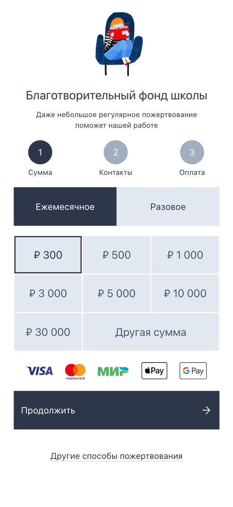

# Комплексный проект для приема пожертвований в благотворительные/эндаумент фонды
### Виджет для оформления пожертвования и оплаты через ЮКаssа. CRM MVP (Airtable)

#### Стек проекта:

|__Front-end__|__Back-end__|__CRM (MVP)__|__Cron script__|
|:---:|:---:|:---:|:---:|
|  | |||

#### Описание папок проекта:

__client__ - клиентская часть проекта\
__server__ - серверная часть проекта\
__pipedream__ - скрипт для step workflow в pipedream

#### Клиентская часть проекта

В виджете реализовано пять последовательных шагов для получение пожертвования от ваших доноров:

__Шаг 1.__ Выбор типа и суммы платежа. Тип пожертвования может быть разовые и ежемесячный. В случае ежемесячного платежа донор разрешает фонду списывать выбранную сумму безакцептно. Сумму платежа имеет заданный шаг, если донор хочет выбрать произвольную сумму платежа он использует элемент "Другая сумма". В данное поле может быть введана произвольная сумма от 150 до 999 999 рублей.\

__Шаг 2.__ Донор заполняет контактные данные о себе. Минимальный набор параметров фамилия, имя, email. Далее донер соглашается с офертой и политикой обработки персональных данных и нажимает кнопку __"Продолжить"__. Происходить первичная запись данных в базу данных CRM таблица "Customers". Если донор уже ранее делал пожертвование данные в таблице базы данных будут обновлены и новая запись создаваться не будет.

__Шаг 3.__ Донор подтверждает оплату выбранной суммы и типа платежа. Формируется запрос к системе ЮKassa и подгружается виджет партнера. На данном шаге происходит записьв базу данных CRM, таблицы Transactions и Subscriptions (если выбран тип платежа - ежемесячный).

__Шаг 4.__ Донор выбирает способ оплаты, вводит данные банковской карты и осуществляет платеж.

__Шаг 5.__ После успешной оплаты осуществляется переадресация донора на страницу благодарности.

 

     

